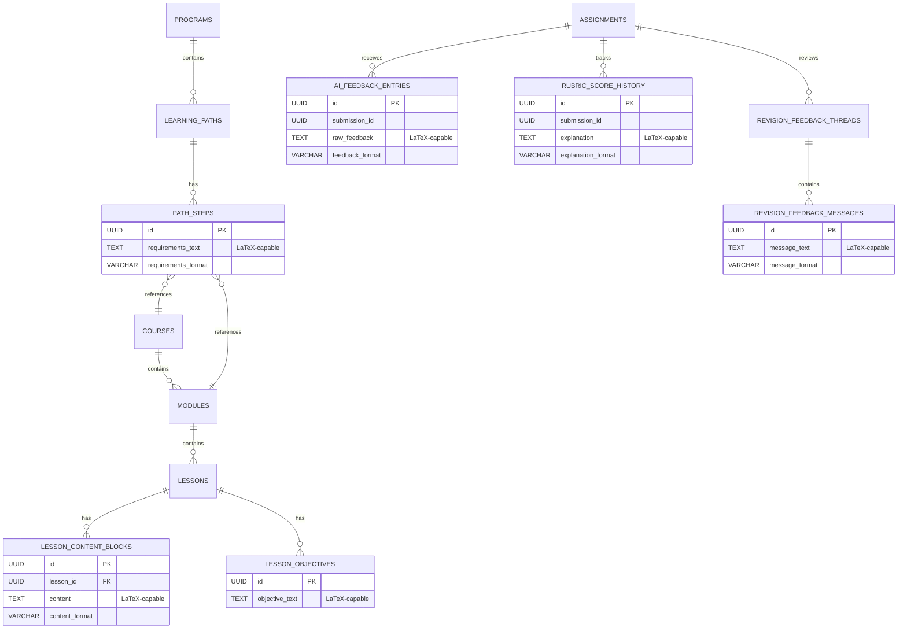

# Data Model Extension: Lessons, AI Feedback History, Learning Paths, LaTeX Support

## 1) Updated Domain Model (LaTeX-aware)

### Lessons / Learning Units
- **Lesson**
  - Belongs to **Module**.
  - Ordered within module via `position`.
  - Supports AI-generated content via `is_ai_generated` and `content_meta`.
- **LessonContentBlock**
  - Belongs to **Lesson**.
  - Orderable via `position`.
  - Types: `TEXT`, `VIDEO`, `INTERACTIVE`, `AI_GENERATED`, `LATEX`.
  - Stores LaTeX-capable content in `content` (TEXT) and `content_format`.
- **LessonObjective**
  - Belongs to **Lesson**.
  - Stores LaTeX-capable objective text in `objective_text`.

### AI Feedback & Rubric Scoring History
- **AIFeedbackEntry**
  - Linked to **Assignment** and a **submission_id** (UUID).
  - Raw LaTeX-capable feedback in `raw_feedback`.
  - Captures AI model metadata: `model_name`, `model_version`, `model_hash`, `model_metadata`.
  - Append-only; never updated for auditing.
- **RubricScoreHistory**
  - Linked to **Assignment** and a **submission_id**.
  - Versioned by `rubric_version`.
  - Stores LaTeX-capable explanations in `explanation`.
  - Supports regrading via new rows, not overwriting.
- **RevisionFeedbackThread**
  - Represents a thread per assignment submission.
  - **RevisionFeedbackMessage** stores immutable messages for each iteration (student, AI, instructor), with LaTeX-capable content.

### Learning Paths / Program Tracks
- **Program**
  - Top-level degree/certification container.
- **LearningPath**
  - Belongs to **Program**.
  - Supports AI-generated recommendations and metadata.
- **PathStep**
  - Belongs to **LearningPath**.
  - References a **Course** or **Module** (mutually exclusive).
  - Stores LaTeX-capable requirements in `requirements_text`.
  - Tracks completion requirements in `completion_criteria` JSONB.

### System-wide LaTeX Support
- All task/assessment entities (Assignments, Quizzes, Question Bank, Lesson content, AI feedback, Rubric explanations, Path requirements) store LaTeX as **TEXT** or **JSONB**.
- LaTeX is transmitted as raw strings, with `*_format` fields indicating `MARKDOWN`, `LATEX`, or `HTML` where applicable.

## 2) ER Diagram (Mermaid)

## 3) Database Schema Additions

### Course Service (Flyway V2)
- `lessons`
- `lesson_content_blocks`
- `lesson_objectives`
- `programs`
- `learning_paths`
- `path_steps`

### Assessment Service (Flyway V3)
- `ai_feedback_entries`
- `rubric_score_history`
- `revision_feedback_threads`
- `revision_feedback_messages`

**Constraints & Indexing**
- Foreign keys are enforced within the service boundary.
- `path_steps` uses a check constraint to require exactly one of `course_id` or `module_id`.
- Indexes target query patterns for ordering, submission history, and lookup by assignment/path.

## 4) Backend Integration Notes

### Validation & Serialization
- Keep LaTeX strings intact in DTOs; avoid escaping/cleaning beyond standard JSON escaping.
- Validate only at the schema level: required fields, `content_format` enumeration, and max length where appropriate.
- All feedback history tables are append-only; services must **insert new rows** for regrades or feedback updates.

### LaTeX-safe Handling
- Use `TEXT` or `JSONB` and ensure ORM uses `@Column(columnDefinition = "text")` or `jsonb` where appropriate.
- Do **not** sanitize LaTeX at persistence time; sanitize only for HTML rendering on the client.

## 5) Frontend Integration Notes

### Rendering Strategy
- Use a single LaTeX renderer across the app (recommended: **KaTeX** for performance, **MathJax** for maximum coverage).
- Render content by `*_format`:
  - `MARKDOWN`: parse markdown, then render LaTeX blocks/spans.
  - `LATEX`: render directly via renderer.
  - `HTML`: sanitize HTML, then render LaTeX nodes.

### Editing Experience
- Provide editor support with a LaTeX preview pane and a toggle for `content_format`.
- Ensure `LessonContentBlock` and feedback editors support inline `$$...$$` and `$...$`.

## 6) AI Integration Notes

### Prompting Rules (LaTeX-safe)
- Always wrap math in `$...$` or `$$...$$`.
- Do not escape backslashes unnecessarily.
- Preserve input LaTeX verbatim; do not “normalize” unless requested.
- Include a validation pass in AI workflows that checks for balanced delimiters and common LaTeX errors before storing output.

