# LearnSystemUCU - UX Flow Analysis

## UX Flow Summary

### Overview
LearnSystemUCU is a comprehensive Learning Management System (LMS) built for educational institutions. The application serves three primary user roles: **Students**, **Teachers**, and **Administrators**. Each role has distinct journeys optimized for their specific educational workflows.

### Main User Journeys

#### 1. Authentication & Onboarding
- Users enter the system via Login or Register pages
- Registration requires @ucu.edu.ua email domain validation
- Users select their role (Student/Teacher) during registration
- Successful authentication redirects to the personalized Dashboard
- Language preference (Ukrainian/English) and theme (Light/Dark) persist across sessions

#### 2. Student Learning Journey
- **Dashboard View**: Stats overview, enrolled courses, upcoming deadlines, recent notifications
- **Course Exploration**: Browse courses → View course details → Access modules
- **Content Consumption**: Navigate through modules → Read materials → Access resources
- **Assessment Path**: 
  - Assignments: View → Submit (text/file/code) → Await grading → View feedback
  - Quizzes: Start attempt → Answer questions (timed) → Submit → View results
- **Code Assignments**: Virtual Lab with code editor → Execute code → Run tests → Submit
- **Progress Tracking**: View gradebook → Check individual grades → Track overall progress

#### 3. Teacher/Instructor Journey
- **Course Management**: Create course → Add modules → Add assignments/quizzes
- **AI-Powered Content Creation**:
  - AI Course Generator: Generate complete course structure from prompt
  - AI Module Generator: Create modules with materials
  - AI Assignment Generator: Generate assignments with rubrics
  - AI Quiz Generator: Create quizzes with questions
- **Grading Workflow**: 
  - SpeedGrader: Navigate submissions → Grade → Provide feedback → Move to next
  - Rubric-based evaluation with point allocation
  - Comment system for student communication
- **Student Management**: Enroll students → View progress → Export grades

#### 4. Assessment Interaction Patterns
- **Quiz Taking**: Timed sessions with auto-submit on timeout
- **Assignment Submission**: Multiple types (text, file upload, code, URL)
- **Virtual Lab**: Code editor with execution environment and test runners
- **Feedback Loop**: Immediate (quiz) or delayed (assignments) feedback display

#### 5. AI Integration Points
- Course generation from natural language prompts
- Module content generation
- Assignment creation with rubrics
- Quiz question generation
- Content editing assistance
- All AI operations show loading states with progress indicators

### Session Management
- JWT-based authentication with token refresh
- Session persistence across page reloads
- Automatic redirect to login on session expiration
- Logout clears all local state and tokens

---

## UX Diagram (Mermaid)

```mermaid
flowchart TB
    subgraph Entry["🚪 Entry Points"]
        Landing["/"]
        Login["/login"]
        Register["/register"]
    end

    subgraph Auth["🔐 Authentication"]
        LoginForm["Login Form"]
        RegisterForm["Register Form<br>(UCU email required)"]
        AuthValidation{"Valid<br>Credentials?"}
        RegValidation{"Valid<br>Registration?"}
        AuthError["Error Message"]
        AuthLoading["Loading State"]
    end

    subgraph Dashboard["📊 Dashboard"]
        DashHome["/dashboard"]
        DashCustomize["/dashboard/customize"]
        StatsWidget["Statistics Widget"]
        CoursesWidget["My Courses Widget"]
        DeadlinesWidget["Deadlines Widget"]
        NotificationsWidget["Notifications Widget"]
    end

    subgraph Navigation["🧭 Main Navigation"]
        Sidebar["Sidebar Menu"]
        Header["Header Bar"]
        NavCourses["Courses"]
        NavCalendar["Calendar"]
        NavAssignments["Assignments"]
        NavGrades["Grades"]
        NavProfile["Profile"]
    end

    subgraph Courses["📚 Course Management"]
        CourseList["/courses"]
        CourseCreate["/courses/create"]
        CourseDetail["/courses/:id"]
        ModulesTab["Modules Tab"]
        AssignmentsTab["Assignments Tab"]
        MembersTab["Members Tab"]
        GradesTab["Grades Tab"]
    end

    subgraph AIFeatures["🤖 AI Features"]
        AICourseGen["AI Course Generator"]
        AIModuleGen["AI Module Generator"]
        AIAssignGen["AI Assignment Generator"]
        AIQuizGen["AI Quiz Generator"]
        AIProgress["AI Processing<br>(Loading State)"]
        AIPreview["Preview Generated<br>Content"]
        AISave["Save to System"]
        AIError["AI Error<br>(Retry Available)"]
    end

    subgraph Assessments["📝 Assessments"]
        AssignmentList["/assignments"]
        AssignmentDetail["/assignments/:id"]
        AssignmentSubmit["/assignments/:id/submit"]
        AssignmentEdit["/assignments/:id/edit"]
        QuizList["Quiz List"]
        QuizDetail["/quiz/:id"]
        QuizTaking["/quiz/:id/take"]
        QuizResults["/quiz/:id/results"]
        QuestionBank["/question-bank"]
        QuizBuilder["/quiz-builder"]
    end

    subgraph VirtualLab["💻 Virtual Lab"]
        VLabPage["/virtual-lab/:id"]
        CodeEditor["Code Editor"]
        CodeInput["Input Data"]
        CodeExec["Execute Code"]
        TestResults["Test Results"]
        CodeSubmit["Submit Solution"]
    end

    subgraph Grading["✅ Grading System"]
        SpeedGrader["/speed-grader"]
        StudentGradebook["/gradebook"]
        AllGrades["/grades"]
        GradeSubmission["Grade Entry"]
        FeedbackEntry["Feedback Entry"]
        RubricEval["Rubric Evaluation"]
        CommentSystem["Comments"]
    end

    subgraph UserManagement["👤 User Management"]
        Profile["/profile"]
        ProfileSettings["/profile/settings"]
        ThemeToggle["Theme Toggle"]
        LangSwitch["Language Switch"]
        Logout["Logout"]
    end

    subgraph States["⚡ Application States"]
        LoadingState["Loading Spinner"]
        ErrorState["Error Display"]
        SuccessState["Success Message"]
        EmptyState["No Data Display"]
    end

    %% Entry Flow
    Landing --> Login
    Landing --> Register
    Login --> LoginForm
    Register --> RegisterForm
    LoginForm --> AuthLoading
    RegisterForm --> AuthLoading
    AuthLoading --> AuthValidation
    AuthLoading --> RegValidation
    AuthValidation -->|Yes| DashHome
    AuthValidation -->|No| AuthError
    RegValidation -->|Yes| Login
    RegValidation -->|No| AuthError
    AuthError --> LoginForm
    AuthError --> RegisterForm

    %% Dashboard Flow
    DashHome --> StatsWidget
    DashHome --> CoursesWidget
    DashHome --> DeadlinesWidget
    DashHome --> NotificationsWidget
    DashHome --> DashCustomize
    CoursesWidget --> CourseDetail
    DeadlinesWidget --> AssignmentDetail

    %% Navigation
    DashHome --> Sidebar
    Sidebar --> NavCourses --> CourseList
    Sidebar --> NavCalendar
    Sidebar --> NavAssignments --> AssignmentList
    Sidebar --> NavGrades --> AllGrades
    Sidebar --> NavProfile --> Profile
    Header --> ThemeToggle
    Header --> LangSwitch
    Header --> Profile
    Header --> Logout

    %% Course Flow
    CourseList --> CourseCreate
    CourseList --> CourseDetail
    CourseCreate --> AICourseGen
    AICourseGen --> AIProgress
    AIProgress -->|Success| AIPreview
    AIProgress -->|Error| AIError
    AIPreview --> AISave
    AISave --> CourseDetail
    CourseDetail --> ModulesTab
    CourseDetail --> AssignmentsTab
    CourseDetail --> MembersTab
    CourseDetail --> GradesTab
    ModulesTab --> AIModuleGen
    ModulesTab --> AIAssignGen

    %% Assessment Flow - Student
    AssignmentList --> AssignmentDetail
    AssignmentDetail --> AssignmentSubmit
    AssignmentDetail --> VLabPage
    AssignmentSubmit --> LoadingState
    LoadingState --> SuccessState
    LoadingState --> ErrorState
    QuizList --> QuizDetail
    QuizDetail --> QuizTaking
    QuizTaking --> QuizResults
    
    %% Virtual Lab Flow
    VLabPage --> CodeEditor
    CodeEditor --> CodeInput
    CodeInput --> CodeExec
    CodeExec --> TestResults
    TestResults -->|Pass| CodeSubmit
    TestResults -->|Fail| CodeEditor

    %% Quiz Flow
    QuizTaking -->|Timer Expires| QuizResults
    QuizTaking -->|Manual Submit| QuizResults
    QuizResults --> QuizDetail
    QuizResults --> AssignmentList

    %% Grading Flow - Teacher
    AssignmentsTab --> SpeedGrader
    SpeedGrader --> GradeSubmission
    GradeSubmission --> RubricEval
    RubricEval --> FeedbackEntry
    FeedbackEntry --> CommentSystem
    CommentSystem --> SpeedGrader

    %% Teacher Tools
    QuestionBank --> QuizBuilder
    QuizBuilder --> AIQuizGen
    AIQuizGen --> AIProgress

    %% Profile Flow
    Profile --> ProfileSettings
    ProfileSettings --> DashHome
    Logout --> Login

    %% Exit Points
    subgraph Exit["🚪 Exit Points"]
        SessionEnd["Session Timeout"]
        LogoutAction["Manual Logout"]
        CompleteLearning["Cycle Complete"]
    end

    Logout --> LogoutAction --> Login
    SessionEnd --> Login
    QuizResults --> CompleteLearning
    GradeSubmission --> CompleteLearning

    %% Styling
    classDef entryPoint fill:#e1f5fe,stroke:#01579b,color:#01579b
    classDef aiFeature fill:#f3e5f5,stroke:#7b1fa2,color:#7b1fa2
    classDef assessment fill:#fff3e0,stroke:#e65100,color:#e65100
    classDef grading fill:#e8f5e9,stroke:#2e7d32,color:#2e7d32
    classDef state fill:#fce4ec,stroke:#c2185b,color:#c2185b
    classDef exit fill:#ffebee,stroke:#c62828,color:#c62828

    class Landing,Login,Register entryPoint
    class AICourseGen,AIModuleGen,AIAssignGen,AIQuizGen,AIProgress,AIPreview,AISave,AIError aiFeature
    class AssignmentList,AssignmentDetail,AssignmentSubmit,QuizDetail,QuizTaking,QuizResults,VLabPage assessment
    class SpeedGrader,StudentGradebook,AllGrades,GradeSubmission,FeedbackEntry,RubricEval grading
    class LoadingState,ErrorState,SuccessState,EmptyState state
    class SessionEnd,LogoutAction,CompleteLearning exit
```

---

## Notes

### Key UX Risks and Complexity Points

#### 1. Authentication Flow
- **Risk**: UCU email domain restriction may confuse external users
- **Complexity**: Dual language support (UK/EN) requires consistent translations
- **Recommendation**: Clear error messaging for email domain validation failures

#### 2. AI Content Generation
- **Risk**: Long processing times (10-60 seconds) with no cancel option
- **Risk**: AI failures may lose user input if form state not preserved
- **Complexity**: Preview step requires users to understand AI-generated content
- **Recommendation**: Add progress percentage and cancellation option
- **Recommendation**: Persist prompt input in case of failures for easy retry

#### 3. Quiz Taking Experience
- **Risk**: Timer auto-submit may cause data loss if network fails
- **Risk**: Browser refresh loses quiz progress (no auto-save)
- **Complexity**: Multiple question types require different interaction patterns
- **Recommendation**: Implement periodic answer auto-save during quiz attempts
- **Recommendation**: Add network status indicator during timed assessments

#### 4. Virtual Lab
- **Risk**: Code execution timeouts may not communicate clearly
- **Risk**: Test case failures show raw output without guidance
- **Complexity**: Different programming languages have different runtime behaviors
- **Recommendation**: Add syntax hints and common error explanations

#### 5. Grading Workflow (SpeedGrader)
- **Risk**: No auto-save for grading progress
- **Risk**: Navigating between submissions may lose unsaved feedback
- **Complexity**: Rubric evaluation requires understanding point allocation
- **Recommendation**: Implement auto-save or save confirmation prompts

#### 6. Navigation & State
- **Risk**: Deep linking to protected routes shows flash of redirect
- **Risk**: Sidebar state not persisted on mobile devices
- **Complexity**: Role-based navigation shows/hides menu items dynamically
- **Recommendation**: Pre-auth route handling before React render

#### 7. Mobile Responsiveness
- **Risk**: Complex tables (gradebook, speed grader) may be unusable on mobile
- **Risk**: Code editor in Virtual Lab may be difficult on small screens
- **Recommendation**: Consider mobile-specific views for data-heavy pages

#### 8. Error States
- **Risk**: Generic error messages don't help users understand problems
- **Risk**: Network errors during form submission may cause duplicate submissions
- **Recommendation**: Contextual error messages with suggested actions
- **Recommendation**: Implement idempotency for critical operations

### Areas Where UX May Break or Confuse Users

1. **Session Expiration**: Mid-action session timeout causes loss of work
2. **AI Streaming**: Long SSE connections may drop without clear feedback
3. **File Upload Limits**: Max file size errors appear after upload attempt
4. **Due Date Timezone**: Due dates may show in server timezone vs user timezone
5. **Quiz Attempt Limits**: Users may not realize they've exhausted attempts
6. **Assignment Types**: Students may confuse submission types (text vs file vs code)
7. **Grade Visibility**: When grades become visible may not be clear to students
8. **Course Enrollment**: Self-enrollment vs instructor-enrollment process unclear

### Positive UX Patterns Observed

1. **Loading States**: Consistent spinner usage across the application
2. **Dark Mode**: Full theme support with persistent preference
3. **Localization**: Bilingual support (Ukrainian/English) throughout
4. **Dashboard Customization**: User-configurable widget layout
5. **AI Integration**: Non-blocking AI operations with preview capabilities
6. **Role-Based UI**: Contextual navigation based on user permissions

