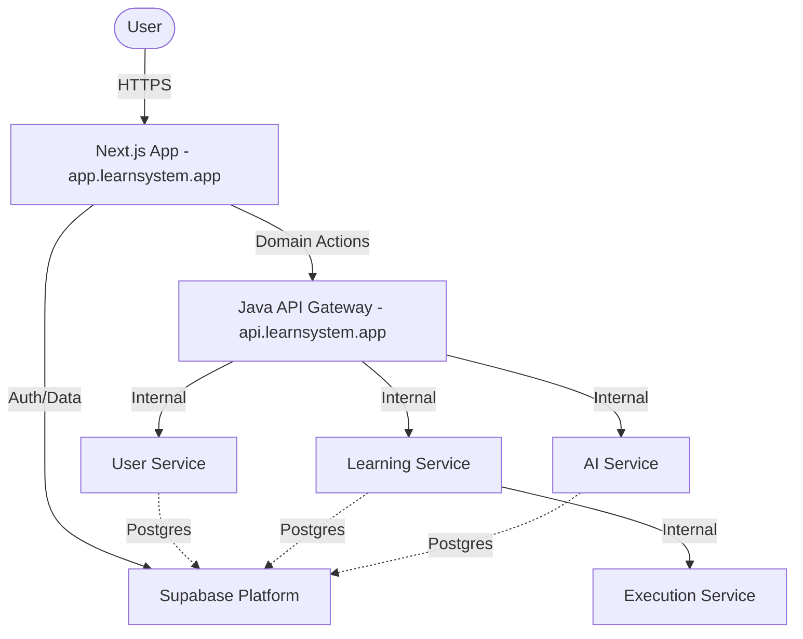

# LearnSystem Architecture

LearnSystem is structured as a monorepo containing a Next.js frontend and a set of Java Spring Boot microservices.

## High-Level Diagram

## Core Layers

### Interface Layer (`apps/web`)
- **Technology:** Next.js (App Router), TanStack Query, Tailwind CSS.
- **Responsibilities:** UI, Routing, Client-side Auth, direct Supabase reads (where RLS allows).
- **Communication:** Sends authorized requests to the Gateway using Supabase JWT.

### Application Layer (`services/`)
- **Technology:** Java 21, Spring Boot 3.2.
- **Gateway:** Unified entry point for all domain logic. Validates Supabase JWTs.
- **Microservices:**
    - `user-service`: User profile and role management.
    - `learning-service`: Core domain (courses, modules, lessons, assignments).
    - `ai-service`: AI generation and grading assistance.
    - `execution-service`: Internal Python-based code runner for VPL.

### Infrastructure Layer (`supabase/`)
- **Identity:** Supabase Auth (OIDC Provider).
- **Persistence:** Supabase PostgreSQL.
- **Storage:** Supabase Object Storage (avatars, submissions).

## Domain-Driven Design
The system follows DDD principles. Logic related to code execution (VPL) is encapsulated within the `learning-service` but delegates heavy-lifting to the isolated `execution-service`.
